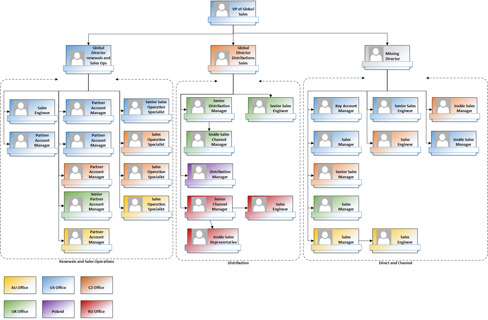

#Úvod
# Charakteristika podnikatelského subjektu
## Charakteristika podniku
**Název**: Kerio Technologies, s. r. o.

**IČO**: 25212974

**Datum vzniku**: 18. srpna 1997

**Sídlo**: Anglické nábřeží 1, PSČ 301 49 Plzeň

Společnost Kerio Technologies, s. r. o. (dále jen Kerio) zvnikla v roce 1997 v Plzni v České republice. Nyní má hlavní sídlo ve městě San Jose ve státě California ve Spojených státech amerických (USA). Pobočky se pak dále nacházejí ve Velké Británii, České republice, Austrálii a Brazílii.

**Základní kapitál**: 100 000 Kč

**Předmět podnikání**:
- poskytování software a poradenství v oblasti hardware a software,
- koupě zboží za účelem jeho dalšího prodeje a prodej,
- výzkum a vývoj v oblasti technických věd,
- zprostředkování obchodu a služeb,
- reklamní činnost a marketing.
(citace- výsledovka 2014)

Společnost Kerio je jedním z hlavních výrobců zabezpečovacího internetového softwaru pro malé a střední organizace na celém světě. Zaměřuje se na síťové firewally, bezpečnost interní firemní komunikace a poskytuje řešení pro přenos zpráv.

**Průměrný přepočtený počet zaměstnanců** (k 31. 12. 2015): 110

**Organizační struktura společnosti**

V čele společnosti stojí výkonný ředitel spolu s představenstvem společnosti. V čele jednotlivých oddělení pak stojí viceprezidenti, kteří spadají přímo pod výkonného ředitele. Společnost Kerio má celkem šest oddělení z čehož největší je oddělení Inženýringu, pod který spadají jednotlivé týmy vyvíjející produkty společnosti, ale né jenom ty (viz. organizační struktura níže).

Pro tuto diplomovou práci je klíčový Sales tým, jeho organizační struktura a jednotlivé týmové role budou rozebrány později.

**Historie společnosti**:

**1997**

V tomto roce firma poprvé vstoupila na trh s internetovými zabezpečovacími technologiemi s produktem WinRoute. Tato řada byla velmi oblíbená a úspěšná, zejména pak produkt WinRoute Pro. Ten si získal velkou přízeň uživatelů především díky jednoduchosti použití, spolehlivosti a výkonu. Také kvůli své cenové dostupnosti se stal lákavou alternativou mnohem dražších firewallů a routerů. Jeho široké využití ho zařadilo mezi využívané produkty mezi síťovými odborníky a administrátory.

**2000 - 2009**

Produkt WinRoute začali používat i zákazníci s nejvyššími bezpečnostními nároky jako US Air Naval Systems nebo gig anti v oblasti cestovních rezervací v USA - společnost Amadeus. V těchto letech WinRoute Pro získal certifikaci od společnosti ICSA Labs a také se objevil jako softwarové a virtuální zařízení. I toto přispělo ke skutečnosti že se WinRoute Firewall stal jedním z nejpopulárnějších softwarových firewallů ve své cenové kategorii.

**2010**

V tomto roce byl vydán produkt Kerio Connect 7 s distribuovanou doménou a CardDAV.

**2011**

V tomto roce vznikly další dva nové produkty a to Kerio Workspace a Kerio Operator.

**2013 - 2014**

Firma představila nový produkt Samepage.io. Jedná se o cloud řešení pro spolupráci v týmech. Nový produkt vyšel ze svého předchůdce, produktu Workspace, který nahradil.

**2015 - 2016**

Firma se rozhodla pro vyčlenění produktu Samepage.io a přetransformovat tento produkt v samostatnou firmu. Kerio na přelomu let 15/16 začalo nabízet cloud řešení svého produktu Connect.

**Produkty společnosti Kerio**

Společnost Kerio se zaměřuje na malé a střední podniky a jejím cílem je umožnit těmto společnostem komunikovat, spolupracovat a být neusátle ve spojení. Kerio se soustřeďuje na vývoj flexibilních, dostupných a snadno použitelných technologíi.

**Kerio Control**

Kompletní produkt pro připojení a řízení přístupu do Internetu a zabezpečení sítě. Mezi jeho nejdůležitější funkce lze zařadit ochranu sítě před viry, malwarem a zákeřnými aktivitami. Tento produkt v sobě spojuje mnoho vlastností jako síťový firewall a směrovač, detekci a prevenci útoků (IPS), antivirovou ochranu, VPN a filtrování obsahu. Tento produkt je mnohem flexibilnější než klasické hardwarové firewally. Dále umožňuje sledovat aktivity jednotlivých uživatelů do nejmenšího detailu. Zákazníci mají možnost zakoupit také produkt Control Box, což je hardwarové zařízení s optimalizovaným výkonem spojující v sobě veškeré zabezpečovací prvky softwarové aplikace a uzpůsobený hardware.

**Kerio Connect**

Cenově přijatelná alternativa k Microsoft Exchange určená pro malé a střední firmy. Jedná se o multiplatformní e-mailový server s podporou mobilních zařízení. Kombinuje funkce e-mailového a groupwarového serveru s antivirovou kontrolou, účinnou antispam ochranou, archivací, automatickým zálohováním a vyniká lehce použitelným webovým rozhraním pro správu, dostupným ze všech běžných webových prohlížečů. Tento produkt je velmi flexibilní, umožňuje malým a středním podnikům využívat platformy a mobilní zařízení dle vlastního výběru.

**Kerio Operator**

Jednoduše konfigurovatelný podnikový telefonní systém, založený na přenosu telefonních hovorů přes internet (VoIP). Produkt je navržen tak, aby usnadnil hlasovou komunikaci a přitom poskytl pokročilé funkce telefonních systému jako - konferenční hovory, dynamické hlasové konference, integrace s podnikovým CRM systémem, směrování hovorů, záznam hovorů, hlasovou poštu do e-mailu, podporu faxu, automatické hlasové menu a fronty hovorů.
Kerio Operator Softphone je telefonní aplikace, která umožňuje přijímat hovory na mobilních zařízeních se systémy iOS nebo Android přímo z firemního telefonního systému.

**Kerio Cloud**

Nejnovější přírustek v rodině Kerio produktů. Jedná se o hostování e-mailu, instant messagingu či hlasových služeb v cloudu. Jedná se o alternativu k "on-premise" produktům. Produkt umožňuje synchronizovat všechna data aplikací, které uživatel denně používá. Díky technologii "Direct Push" jsou synchronizována i data počítače uživatele a zobrazují se na jeho chytrém zařízení.

**Cloudová služba Samepage**

Je privátní cloud a platforma pro týmovou spolupráci. Tento produkt umožňuje vytvářet, organizovat a sdílet širokou škálu obsahu a přistupovat k němu prostřednictvím jediného intuitivního rozhraní. Slouží jako centrální bod pro spolupráci a díky němu jsou informace, které jsou nutné pro týmovou spolupráci,vždy k dispozici. 
(poznámka pod čarou: vyčlenění společnosti Samepage (dále jen SIO) v době vzniku této práce, ještě nebylo dokončeno, proto je uvedena mezi produkty společnosti Kerio)

Své produkty společnost rozšiřuje po celém světe, jejich jednoduchá řešení pomáhají zvyšovat produktivitu milionům uživatelů po celém světě ve více než 60 000 firmách. Všechny výše uvedené produkty jsou nabízeny prostřednictvím sítě než 6 000 obchodních partnerů.

#Charakteristika interních systémů#
Z výše uvedené charakteristiky vyplývá, že společnost Kerio disponuje širokou zákaznickou i partnerskou základnou. K tomu aby mohla tyto základy rozšiřovat a dále rozvíjet, potřebuje k fungování soustavu interních a externích systémů.
Tato diplomová práce je zaměřena především na unifikaci procesů pro Sales oddělení společnosti. Proto se především zaměříme na systémy, které primárně podporují fungování tohoto oddělení.
Předtím než bude přistoupeno k charakteristice procesní dokumentace, je nutné si charakterizovat jednotlivé systémy, kterých se procesy týkají.
Dále budou zmíněny i vazby mezi jednotlivými systémy.

##Externí systémy##
###Salesforce###
Salesforce (Dále jen SFDC) je CRM systém, který umožňuje shromažďovat, třídit a zpracovávat údaje o zákaznících, především jejich kontakty a probíhající obchodní procesy.

CRM systémy obecně pak pomáhají sledovat a vyhodnocovat veškeré obchodní aktivity v rámci celé společnosti. Cílem je především zlepšit cílení služeb, lépe porozumět zákazníkům a identifikovat jejich konkrétní potřeby, umožňují budovat dlouhodobé vztahy se zákazníky. (zdroj)

Společnost Kerio tento systém začala používat ke správě informací o svých zákaznících na přelomu let 2012 a 2013. V tomto období začalo vznikat i množství procesů, resp. pracovních postupů pro Sales pracovníky, jak používat tento systém správně. Těmto procesům bude věnována hlavní část práce.
V této souvislosti je potřeba nadefinovat základní objekty, které jsou v SFDC používány a často se vyskytují v procesních popisech.

* **Lead**- kontakt na potencionálního zákazníka, který projeví zájem o koupi produktu či služby.
* **Account**-neboli účet, jsou zde zobrazeny informace o společnosti, se kterou Kerio obchoduje,  nebo se chystá obchodovat. Lze zde najít informace jako: adresu společnosti, druh partnera, informace o prodejích a další podrobnosti. Je zde také možné dohledat příležitosti (_Opportunity_), přídacy (_Case_) a seznam všech kontaktů (_Contact_) ve společnosti.
* **Contact**- neboli kontakt. Teto objekt obsahuje informace o konkrétní osobě z určité společnosti, jako jeho pozice ve firmě, telefon, e-mail atd.
* **Case** - neboli případ. Případ je většinou generovány na základě různých požadavků partnerů, či koncových uživatelů. Případy nejsou přímým zdrojem příjmů pro společnost Kerio.
* **Opportunity** - neboli příležitosti, které společnosti vznikají. Mohou být nové, nebo generované automaticky pro obnovu stávající licence pro partnera (tzv. SWM). Příležitosti jsou hlavním zdrojem příjmů pro společnost. 
* 
Salesforce je propojen s dalšími systému společnosti, jako jsou Marketo a KISS.

(vysvětlivka pod čarou: CRM system -CRM je zkratka z anglického Customer Relationship Managament a označuje se tak systém pro řízení vztahů se zákazníky.

###Marketo###
Jak už název napovídá, tento nástroj je především využíván Marketingovým oddělením společnosti. Tento systém využívá Marketing Automation, což je kategorie technologie, která umožňuje společnostem zjednodušit, automatizovat a měřit marketingové aktivity a tím zvýšit provozní efektivitu a tím i růst tržeb podniku.
Marketo je využívané pro tvorbu e-malových kamapní pro partnery, sledování aktivity potencionálních zákazníků/partnerů na webu firmy atd. Tyto informace se pak propagují v podobě potencionálního kontaktu (_Lead_) do SFDC, kde sním posléze pracuje určený pracovník Sales.

###Zuora###
Zuora byla přidána, do souboru externích systému kvůli produktu Samepage. Jedná se o fakturační nástroj, který funguje na základě subscription business model- zákazník musí zaplatit "předplatné" (u SIO měsíční) aby mohl službu používat na plno. Platby byly prováděny přes tento systém a záznam o platbě propagován do SFDC.
Zuora byla dále napojena na SIO, kde se subskripce vytvářely, i tato informace, vytvoření nového účtu ve službě SIO, byl propagován do SFDC.
Tento systém v současnosti již není využíván společností Kerio, je zde uveden pouze pro úplnost.

###WHMCS###
Tento systém je nejnovějším přírůstkem mezi externími systémy. Firma ho začala využívat v souvislosti s nabízenou službou Kerio Cloud. Jedná se o platformu pro hostování a správu webů, fakturaci klientů s vysokou mírou automatizace(WHMCS - Web Hosting billing and Automation Platform). Tento systém je taktéž navázán na SFDC. (zdroj) *poznámka pod čarou: v dohledné době se plánuje i propojení se systémem KISS.

[Všechny výše uvedené systémy patří pod správu Integračního týmu, který spadá do oddělení Inženýringu. ]

##Interní systém##
###KISS###
_Kerio Information and Sales System_ - zkráceně KISS - je interní informační systém, který byl vyvinut pro prodej Kerio produktů a to jak koncovým zákazníkům, tak partnerům. Zahrnuje objednávkový a fakturační systém, správu licencí a reporty. Před zavedením CRM systému SFDC byl jediným zdrojem informací o zákaznících. Nyní je prvotním systémem, ve kterém jsou uloženy informace o zákaznících SFDC. 
Systém KISS je ze SFDC propojen, do SFDC se přenáší hlavně informace o licencích zákazníků, ale ne jenom ty. 

[Správu a vývoj toto systému spadá do kompetencí integračnímu týmu, konkrétně týmu interních systému]

[Obrázek propojení systému - staré]

Na obrázku je zobrazeno propojení jednotlivých systému v době, kdy Samepage fungovala jako produkt Keria a nebylo zahájeno její vyčlenění. 	Vyčlenění SIO nemělo vliv jen na systémovou strukturu, ale také na procesy, proto je zde tento stav uveden.
[Obrázek propojení systému - nové]

Na dalším obrázku je již vyobrazen současný stav.

Lze říci, že hlavním zdrojem informací o zákaznících je Marketo, ze kterého se tyto informace automaticky přeposílají do SFDC, kde se s nimi dále pracuje. Synchronizace mezi těmito systémy probíhá několikrát denně.
Dalším důležitým propojením je synchronizace z KISS do SFDC. Dříve se importovaly do SFDC pouze čísla licencí. Záznamy v KISS a SFDC jsou propojeny ID*. Mohlo docházet k tomu, že mohly vznikat duplicitní záznamy. Dlouhodobou snahou je, aby SFDC byl primární systém, ve kterém jsou drženy všechny záznamy o zákaznících a ty byly zanášeny do KISS.

(poznámka pod čarou: Identifikační číslo)

Po stručné definici jednotlivých systémů a jejich propojení můžeme přistoupit k charakteristice popisu procesů pro Sales tým.

[Spolu se základní charekteristikou systému je dále potřeba nadefinovat základní pojmy, které se budou v procesech vyskytovat a je potřeba chápat jejich váznam. Pak může být přistoupeno k charakteristice popisu procesů pro Sales tým.]

#Výchozí stav procesní dokumentace#
V této kapitole bude nadefinován pojem proces, dále pak bude přiblížena organizační struktura Sales týmu a nadefinované jednotlivé role tohoto týmu.
Členové Sales týmu nejčastěji pracují se systémem SFDC, který byl již charakterizován. Vybrané role v týmu pak pracují se systémem KISS.
Dále je potřeba uvést, že společnost Kerio působí celosvětově, proto jsou procesní postupy uváděny v angličtině.

##Definice Procesu##
Procesy existují uvnitř každé organizace i mezi nimi. Procesy existují bez ohledu na to, jak dobře jsou řízeny.
Každá organizace je v podstatě organizovaná soustava procesů a činností, které na sebe vzájemně navazují, vzájemně interagují, pobíhají napříč organizačními jednotkami, reagují na různé podněty z vnitřního i vnějšího prostředí. V procesech se transformují stupy a zdroje na výstupy, které zhodnocuje zákazník procesu. 

**Definice procesu dle literatury**

Řepa,V., 2006 definuje proces jako: _„Souhrn činností transformujících souhrn vstupů na souhrn výstupů (zboží nebo služeb) pro jiné lidi nebo procesy, používajíce k tomu lidi nebo nástroje“._

Basl, J., 2002: _„Proces je tok práce, postupující od jednoho člověka k druhému a v případě větších procesů pravděpodobně z jednoho útvaru do druhého“._

Grasserová, M., 2008: _„Proces chápeme jako strukturovaný sled navazujících činností popisujících tok práce – postup tvorby přidané hodnoty – postupující od jednoho pracovníka ke druhému (v případě složitých procesů z jednoho útvaru do druhého), poskytující měřitelnou službu / výrobek internímu nebo externímu zákazníkovi za předpokladu přeměny vstupů na výstupy a využívání zdrojů.“_

Proces je tedy možno obecně chápat jako pojem pro postupný tok aktivit, stavů, dějů nebo práce. V praxi se pojem proces používá v různých významech, v reálném světě existuje více typů procesů. Je proto důležité znát kontext v jakém se o procesu hovoří, aby nedocházelo k nedorozumění.

* **Business proces** - je chápán jako tok činností a práce
* **Produční proces** - je chápán jako tvorba hodnoty, produktu
* **Systémový proces** - je chápán jako běh softwaru
* **Výrobní proces** - je chápán jako tvorba produktu
* **Technologický proces** -  je chápán jako postup výroby nebo tvorby něčeho
* **Chemický proces** - je chápán jako chemický děj

V této diplomové práci bude označení proces užíváno pro Business procesy(taktéž podnikový proces či obchodní proces), tedy pro popis toku činností a práce.

##Organizační struktura Sales týmu##
Jak již bylo zmíněno v úvodu,
Celý Sales tým spadá pod viceprezidenta globálních prodejů (VP of Global Sales). Pod ním stojí ředitelé (Directors), kteří mají na starost jednotlivé týmy, respektive jednotlivé trhy.
Na začátku zpracování této práce fungovali v Sales týmu 3  globální ředitélé a jeden ředitel prodeje. V průběhu roku 2015 došlo v týmu k určitým změnám, které vyústily v to, že Sales tým nyní vedou dva globální ředitelé. 
Odpovědnosti ředitele, i členů týmu, je potřeba uvést pro pozdější srozumitelnost procesních popisů. Týmové role jsou nadefinovány na Samepage a jsou odtud převzaty.

[]

Nyní tedy fungují dva globální ředitelé a to:
**Global Director Renewals and Sales Ops**
Ředitel je zodpovědný za tým, který má na starosti veškeré operace z obnovováním běžícího obchodu (SWM licence atd.), Nyní má na starosti také Direct Chanel jehož hlavním cílem je získávát nové zákazníky a partnery a to do doby než se najde nový ředitel. *Nový ředitel byl jmenován v dubnu tohoto roku

**Global Director Distribution Sales**
Ředitel je zodpovědný za tým který, který má na starosti Distributory.

Vybranými odpovědnostmi ředitele jsou:

- Určování strategie pro přímé i nepřímé trhy
- Definovat procesy a osvědčené postupy pro Sales tým
- Správa prodejních systémů
- Implementace strategie pro přímé i nepřímé trhy
- Oslovování potencionálních partnerů
- Vedení Sales týmu v daném regionu

Pro účely této práce je důležité si povšimnout bodu 2, konkrétně toho, že ředitel je odpovědný na definici procesů pro svůj tým.

Obecně lze říci že tým Renewals adn Sales má na strárosti stávající obchod, Channle má na starosti získávání nových obchodních příležitostí a týmd Distribution v sobě kloubí oboje.
 
##Role v Sales týmu##
Stejně jako je důležité mít vymezeny odpovědnosti ředitele, je potřeba nadefinovat i náplň práce a odpovědnosti jednotlivý rolí v Sales týmu. V současné chvíli v Sales týmu fungují tyto role:
 
- **Sales Operation Specialist (Sales Ops)** 
Je odpovědné za veškeré operace, které je nutné provést v systému KISS a týkají se zejména licencí  či fakturace. Mezi vybrané operace patří: změny na licenci, manuální zpracování objednávky, refundace, požadavky na NFR*. Tato role spadá do týmu Renewals and Sales Operations.
*vysvětlivka - NFR - Not for Resale. Tyto licence jsou jednou z výhod partnerského systému Kerio. Kromě využití v každodenním provozu má partner možnost produkty Kerio otestovat, použít je k demoverzi u zákazníků nebo ke školením.

- **Partner Account/Senior Account Manager (Pam)** - Reaguje na všechny požadavky, které přicházejí ze strany partnerů či SM. Proaktivně spravuje požadavky na obnovy licencí zákazníka a dále je odpovědná za partnerské certifikace. Partnerské certifikace jsou po partnerech společnosti vyžadovány, odvíjí se od nich úroveň partnerství. Na základě dosažené úrovně partnerství se pak zakládá sleva, kterou firma partnerovi poskytuje. V souhrnu se dá říci, že jejím cílem je udržet a dále rozvíjet stávající obchod. Spadá do týmu Renewals and Sales Operations
 

- **Inside Sales Channel Manager (SM)** - Má na starosti nabírání nových partnerů a jejich vedení v příslušném regionu, tréningy, interní kvartální reporting atd.
Tato role spadá do týmu Distribution.

- **Distribution manager (SM)** - Je v úzkém kontaktu s Distributory. Realizuje prodejní strategii v daném regionu, koordinuje akce Distributorů a jejich kampaně. Získává nové partnery a navštěvuje akce Distributorů. Spadá do týmu Distribution.

- **Inside Sales Representative (ISR)** - Získává nové reselery ve specifických oblastech, zpracování partnerských požadavků a registrací z těchto oblastí, Lead managament. Spadá do týmu Distribution

- **Sales/Senior Sales/ Manager (SM)** - Úzce spolupracuje s partnery, hlavně přímými. Pravidelně je navštěvuje, je odpovědný za plánování pro partnery a určování dlouhodobých cílů. Spadá do týmu Direch and Channel

- **Inside Sales Manager (ISM)** - Zpracovává zejména kontakty na potencionální zákazníky - ty vyhodnocuje a dále s nimi pracuje dle procesu. ISM zpracovává i řadu případů provozního charakteru. Spadá do týmu Direch and Channel.

- **Sales/Senior Sales/ Engineer (SE)** - Má na starosti všechny pre-sales technické činnosti s partnery a koncovými zákazníky. Také poskytuje produktová školení partnerům na přiřazeném území. SE je přítomen ve všech týmech

Je opět nutno podotknout, že charakteristiky jednotlivých Sales rolí, byly nalezeny na SIO v průběhu přepisu procesů do nového tvaru. 
Na začátku tedy vznikal často problém, určit člověka odpovědného za proces a poté roli, která má proces vykonávat.

#Původní procesní dokumentace#
V této části bude charakterizována původní dokumentace, shrnuty identifikované problémy spolu s možnými řešeními.

Předtím, než byly zahájeny práce na unifikaci procesů, bylo potřeba provést následující operace:
- seznámit se se systémem SFDC, KISS a pochopit jejich propojení s dalšími systémy
- identifikovat problémy ve stávajících procesech
- ujasnit si formát, do jakého budou procesy unifikovány a zároveň s tím odstranit či minimalizovat identifikované problémy

Jak již bylo zmíněno v úvodu, procesy začaly vznikat v době, kdy se Kerio rozhodlo používat pro správu svých zákazníků další systém a to SFDC. 

V průběhu příprav na přepracování popisu procesů byly identifikovány následující problémy. K problémům je zároveň přiřazeno i navrhované řešení a příklady realizace tohoto řešení.

###První problém###
V původních procesech nebyl jasně nadefinován vlastník procesu, což v mnohém stěžovalo situaci v průběhu přepisu procesu. Nové verze bylo potřeba prokonzultovat s daným vlastníkem procesu, který je za ni odpovědný. Z výše uvedeného popisu odpovědností ředitele, je jasné, že pro ověření procesu bylo potřeba kontaktovat ředitele.

Pro úplnost je uvedena obecná definice vlastníka procesu:

**Vlastník procesu** - představuje konkrétní osobu, která je odpovědná za realizaci procesu, jeho aktualizaci a zlepšování". Vlastník procesu má možnost provádět požadované změny v procesu aby dosáhl cílů procesu.(zdroj)

**Řešení**

Ke každému procesnímu popisu je potřeba přidat jasnou definici vlastníka procesu, který je odpovědný za jeho definici a posléze i za schvalování změn v tomto procesu. 

Ke každému procesnímu popisu byla na začátek přidána sekce, ve které je nadefinován vlastník procesu - povětšinou je to jeden z ředitelů, či přímo viceprezident. Vlastník je vždy uveden jménem. Zde je potřeba uvažovat i případné změny ve vedení Sales týmu. Bylo zvažováno jména nahradit funkcí vlastníka procesu.

**Příklad**

[Obrázek SPR před a po jenom část kde je nadefinovaný owner]

V procesních popisech, které byly předmětem této diplomové práce lze v případě procesů pro Sales tým rozlišovat dva vlastníky.
Vlastníka ze strany Sales týmu, čili ředitele, který nadefinuje hrubý obsah proces a požadovaný výstup. Na pracovních ES týmu je pak tuto představu rozvést do příslušných procesních kroků, případně nastavit systém SFDC odpovídajícím způsobem.
Proto se v kolonce vlastník procesu, může vedle odpovědného ředitele objevit i druhý vlastník a to ES tým. 

Definice vlastníka je jedním z atributů, kterým je proces definován. Obecnými základnami atributy, které definují proces pak podle Basla(2002) jsou:
- **Hranice procesu** - mají svůj začátek a konec
- **Vstupy a výstupy procesu** - **vstupy** jsou inicializační události zahajující proces. **Výstup** je chápan jako produkt procesu, který je doručený zákazníkovi. Výstup zároveň ukončuje činnost procesu. Je nutné zaručit homogenitu vstupů a výstupů procesů.
- **Majitel procesu** - člověk odpovědný za efektivitu procesu.
- **Zákazník procesu** - osoba, organizace nebo následný proces, který je příjemce vstupu z předchozího procesu.
- **Zdroje** - jsou to pracovní prostředky, lidská práce a informace. Zdroje se nespotřebovávají jednorázově , ale jsou užívány opakovaně (postupně).
- **Regulátory řízení** - systém pravidel a norem , zákonů, směrnic které jsou potřebné pro realizaci požadovaného výstupu

###Druhý problém###
Dalším problémem a zároveň omezením je, že všechny procesní popisy se nacházejí v produktu Samepage, který společnost Kerio využívá pro spolupráci.

Nevýhody použití tohoto produktu s dlouhodobého hlediska:
 -  produkt SIO se pořád vyvíjí a mění
 -  vyhledávání v SIO není dokonalé - existují zde spousty vytvořených dokumentů, ve kterých se těžko hledá, pokud není klíčové slovo velmi výstižné

**Řešení**

Důležité je sjednotit rozložení procesních popisů na stránce a to z důvodu kompatibility s další verzí SIO. Vzhledem k tomu že se produkt stále vyvíjí, je potřeba popis zanechat jednoduchý, připravený na případnou migraci do nového prostředí.
U přepisu je také potřeba brát ohled na správné pojmenování procesu a tím se pokusit vylepšit vyhledávání na SIO. Pokud budou správně použitá klíčová slova, vyhledávání by mělo být jednodušší.

Krajním možným řešením je najít jiný nástroj ve kterém by se procesní deskripce udržovaly, pokud SIO přestane vyhovovat.
 
**Příklad**

Mnohé procesy, které původně byly rozprostřeny až do třech sloupců, byly sjednoceny do jednoho sloupce. Pravidla pro psaní procesů a jejich rozložení na stránce byly definovány v pravidlech.
 
[obrázek pravidel]

V mnoha případech pak došlo i ke změně pojmenování původního procesního popisu.

**Příklad**
Jedním z procesů, která byl přejmenován, se zabývá nominováním partnera do vyhledávače partnerů, který má společnost Kerio na svých stránkách a zároveň zvášením jeho partnerské úrovně.

**Název původního procesu** - Nomination to Partner Portal Locator
**Nový název**- Increase of partner level

Název byl změněn po poradě ze Sales týmem, kdy bylo zjištěno, že zvýšení partnerské úrovně, je v souvislosti s výsledky certifikací napadne dřív, než nominace do vyhledávače partnerů.

###Třetí problém###
V původních procesních popisech nebylo jasně definováno, kdo mám proces vykonávat.
Na základě výše uvedených atributů procesu lze konstatovat, že v procesech chyběl definovaný zdroj.

**Řešení**

V procesech je potřeba tyto role, zdroje, definovat. Po zvážení několika variant byla zvolena definice rolí na základě barev. Tyto definice je pak potřeba globálně udržovat a dodržovat jejich použítí. Toto použití je potřeba ukotvit v obecných pravidlech psaní procesů.

**Příklad**

Jednotlivé role, resp. zdroje, jsou definovány barvami v dokumentu Global Guidance. Níže je vidět jak ukázka z Global Gudinace, tak porovnání starého a nového procesu.

[obrázek starého Refund Policy, obrázek nového,]

Z nové verze procesu je, dle Globa Guidance jasné, že proces je prováděn zejména rolí PAM.

###Čtvrtý problém###
Každý proces byl jiný, jinak napsaný, měl jiné náležitosti, podle toho, kdo ho vytvořil (napsal)

**Řešení**

Je potřeba vytvořit jasná pravidla podle kterých se budou procesy tvořit a kde bude nadefinováno, jaké náležitosti proces musí mít.

Výše uvedená řešení byla shrnuta v průběhu přepisu do souhrného dokumentu Global Guidance, kde byly pravidla nadefinována. Jsou zde nadefinované barvy pro role, kterých se proces týká, je zde nadefinováno rozložení procesu a stejně tak náležitosti, které by měl procesní popis obsahovat.
Podobě Global Guidance bude věnována pozornost ještě později-

**Příklad**

Procesy nyní mají jasně definované sekce, což to je notně zpřehlednilo. 

[obrázek porovnání starého z novým Increase of partner level] -> vybrat jiný

###Pátý problém###
Procesy jsou dlouhé, mnohdy nesrozumitelné, proto je většina členů Sales týmu nečte, i přesto, že zadávání informací do systému, či zpracování jednotlivých úkonů v určitém pořadí je pro správnost dat v systému klíčové.

**Řešení**

Řešením v tomto případě je revize popisu všech procesů, kontrola jejich správnosti, vytřídění nepotřebných informací do zvláštní sekce procesu a zanechání pouze čistého procesního popisu, který bude krátký, výstižný a bude obsahovat pouze kroky nutné k úspěšnému vykonání procesu od začátku do konce.
Dalším pomocníkem je zvýraznění důležitých pasáží procesu, aby bylo možné proces číst dvěma způsoby:

- 1. pokud se potřebuji s procesem seznámit, je nový, čtu proces celý
- 2. pokud se potřebuji ujisti o dalším kroku, je možné rychle přečíst text pomocí zvýrazněných klíčových slov - povětšinou akce a objekt k akci určený.

**Příklad**
Jako příklad je zde uvedena procesní popis, který sloužil pro partnerskou registraci. Tento proces byl v průběhu revize procesních popisů aktualizován a měněn hned několikrát, proto je mu věnována samostatná část této práce.

###Šestý problém###
Špatné třídění procesů. Jak je vidět na obrázku níže, procesy vznikaly velmi genericky, byla zde snaha je roztřídit do skupin, nicméně po čase skupiny přestaly odpovídat a postupným vnořováním jednoho procesu do druhého, respektive stránky do druhé, vznikaly zmatky.
Lze vidět, že procesy pro Sales tým byly promíchány s procesy, které jsou čistě pro systém KISS, dále pak jsou promíchány i speciální procesy pro systém Samepage.
 

Poznámka: tento obrázek je uveden v textu jen pro ilustraci, v plném rozsahu je uveden v příloze této práce.

**Řešení**

Řešením v tomto případě je setřídění procesů do smysluplných celků. Dále je potřeba vytřídit procesy, které už se nepoužívají a ty pak přesunout do složky archivu, kterou je potřeba také vytvořit. U setřídění je potřeba také překontrolovat práva, která jsou udělena na jednotlivé stránky, aby bylo zajištěno, že ti pracovníci, kterým jsou procesy určeny k nimi nadále budou mít přístup. U Archivu pak bude přístup zamezen, aby nedocházelo k případnému zmatení.

Dále je potřeba vzít v úvahu i rozdělení společností a také to, že společnost Samepage bude mít svůj vlastní CRM systém.                                                                                                                                                                                                                                                                                                                                                                                                                                                                                                   Proto budou zvlášť vytříděny procesy pro zpracování zákazníků SIO - s těmito se dále pracovat nebude, protože momentálně není možné rozhodnout, které z nich jsou dále pro Kerio Sales tým relevantní, a které ne.(* Tato problematika byla projednána s odpovědným ředitelem, a bylo zjištěno, že tyto procesy pro společnost Kerio momentálně nejsou prioritní)

Třetí složkou, která bude vyčleněna, bude složka obsahující procesy, které jsou vykonávány pouze v systému KISS. Tyto procesy jsou prováděny povětšinou rolí Sales Ops, proto je možné pro větší přehlednost Sales procesů tyto procesy vytřídit do samostatné složky.

[Obrázek nové struktury] -> jenom struktura úvodní strany

V Sales procesech tedy zůstanou procesy relevantní pro členy Sales týmu.

Sales procesy jsou dále členěny takto: (Anglické názvy složek jsou zde zanechány účelně, stějně tak tomu bude v pozdějších sekcích, které již budou věnovány konkrétním popisům procesu) 

- **Account management**- tato složka obsahuje procesy vztahující se přímo k objektu Account v SFDC, který byl již nadefinován výše, v základních objektech SFDC. Obsahuje procesy pro rozvoj vztahů se zákazníky.
- **Cases** - obsahuje procesy, které se vztahuji k objektu Case, tedy zpracování požadavků od zákazníků, či partnerů 
- **Lead** management - obsahuje procesy, které se věnují zpracování potencionálních kontaktů na zákazníky
- **Opportunity management** - zahrnuje procesy, kde na začátku stojí obchodní příležitost. Dále obsahuje procesy, které zahrnují další možné akce s danou příležitostí.
- **Partner management** - zde jsou obsaženy procesy, které se týkají partnerů - zvyšování jejich úrovně partnerství, registrace do partnerského portálu atd.
- **Salesforce general actions** - obecné procesy, které se vztahují k systému SFDC, například jak zadávat vykonané aktivity do systému SFDC, jak spojovat duplicitní záznamy atd.
- **Samepage Ordering** - jediný z procesů SIO, který zůstal zařazen mezi Sales procesy. Popisuje objednávací proceduru produktu Samepage pres interní systém KISS.
- **Operational Processes** - Obecné operativní procesy

Nové složky v roce 2016:
- **Data synchronization from SFDC to KISS** - tyto procesní popisy vysvětlují jak funguje synchronizace mezi těmito dvěma systémy a v jakých případech je potřeba do ní zasáhnout manuálně
-**Kerio Cloud processes**- celá skupina nových procesů, které se věnují nově poskytované službě Connect v klaudu.

Nové procesní popisy jsou již tvořeny plně v souladu s Global Guidance.

###Osmý problém###
Tím, že se procesy hodně opakují a nepoužívají se odkazy, dochází k tomu, že jejich údržba a aktualizace je velmi obtížná. Pokud je změněn krok na jednom místě, měla by se tato změna promítnout i do ostatních procesů. Dále je zde potřeba udržovat značné množství ilustračních obrázků.

**Řešení**
Odstranění duplicit. Případné opakování vytknout do podprocesu a na ten pak v průběhu hlavního procesu odkazovat. Tím se zlepší přehlednost i udržovatelnost procesu samotného - případné změny se provedou pouze na jednom místě, nebude třeba procházet množství procesů a provádět úpravy jednotlivě.
Ilustrační obrázky je potřeba omezit a v průběhu přepisu se maximálního množství stávajích, neaktuálních zbavit. Je potřeba vytvořit tak jednoduchý popis, který bude srozumitelný a zvládnutelný i bez použití obrazové dokumentace.

**Příklad**
[Manage KKP access proces, tady můžu požít nová]

###Devátý problém###
Jasná definice akce, která odstartuje celý proces. Tyto události byly v některých popisech procesu zahrnuty, ovšem nebyly patrné na první pohled.

**Řešení**

Vyčlenění této události (která je vstupem tohoto procesu a výstupem procesu předcházejícího),případných automatických kroků, nebo podmínek, které musí být splněny, než bude možné aby pracovník pokračoval v procesu, do separátní sekce na začátku procesu.

**Příklad**
[Posílání Annex A - prerequsites]

Všechny navrhnutá řešení výše a jejich dokumentace daly za vnik Gloubal Guidance, která je jakýmsi návodem, jak tvořit a číst procesy ve společnosti Kerio.
Dále byly nadefinovány pravidla pro rozložení procesu na stránce a také vytvořená šablona, kterou je možné zkopírovat a začít tvořit procesní deskripci. Šablona obsahuje i nápovědu, co je potřeba zapsat do kterého políčka, případně jak pokračovat.

V následující kapitole budou tyto změny podrobněji rozebrány.

#Global Gudiance#

V některých výše uvedených řešeních problémů byl zmíněný dokument Global Guidance.
Global Guidance je souhrnný dokument, který má sloužit jako průvodce při psaní procesu, ale také při jeho čtení. (*do přílohy celou GG?)

Tento průvodce je rozčleněn do následujících částí:
* poznámka pod čáru: anglické názvy těchto sekcí jsou zde opět ponechány účelně.

**Overview**

Tato sekce obecně obsahuj informaci o tom, co za informace lze na stránce najít, případně odkazy na další přidružené stránky s důležitými informacemi.
V tomto případě se v této sekci nachází odkaz na šablonu- Template, pro psaní procesů, které se budeme věnovat později.
[obrázek?]

**Definiton of colors used**

Tato sekce obsahuje definice jednotlivých barev, které se v procesech vyskytují.

Barvy v procesech jsou použity na dvou místech:
1. **V nadpisech** - barva nadpisu slouží pro rozlišení rolí, zdrujů, které mají proces vykonat
2. **V textu**- základní barvou textu je černá, kdy se pro zváraznění a přehlednost textu používá vytučnění slov.  

[obrázek barviček]

ad 1. **Title colors**

V této části je nadefinováno použití celkem pro 8 barev. Z toho 4 definují sales roli, která má vykonat dané procesní kroky. U každé definice je také použit odkaz na příslušný proces, kde je barva použita. Tyto barvy jsou v nadpisech nejpoužívanější.
Černá barva je volena jako neutrální a je používána u overview. Zbylé tři barvy nejsou používány tak často a jsou určeny spíše pro speciální případy.
Vysvětlení z partnerovy strany, která požívá šedivý nadpis je pak v procesech použita minimálně.

ad. 2 **Colors in text**

I zde jsou ke každé definici barev přidané příklady použití těchto barev. Základní barvou je černá, jak už bylo zmíněno. Další bavou, která je v textu použitá ke zvýraznění důležitých kroků je červená.
Změny v procesu, rozhodnutí o tom, kterou větví procesu se vydat dál jsou v procesu zvýrazněny fialovou.
Další barvy jsou pak použity pro odkazy ať už na obrázky, nebo mezi stránkami.
V textu je také možné najít separátně zvýrazněny kroky, které provádí systém automaticky, jeli to pro proces důležité

Další významnou sekcí v GG jsou pak procesní mapy. Tyto procesní mapy by měly posloužit k lepší orientaci mezi procesy.
Jako první je uvedena legenda, vysvětlující opět barvy a pak také styl provázanosti mezi procesy.
[obrázek legendy]

**Process page map**

Na této mapě je rozkreslena struktura stránek. Na hlavní stránku byla kromě tří sekcí s procesy přidána stránka s GG a také šablona.
Dlašími důležitými složkami jsou Drafty a Archive.
Drafty slouží pro tvrobu procesu - proces vzniká v této složce, kde jsou nastaveny speciální práva, jetnotliví členové Sales týmu zde namají přístup, pokud je nepozve page owner. To je povětšinou buď někdo z vedení Sales týmu (VP nebo Directror), či příslušný zástupce IS týmu. Poté co je proces odladěn a prodiskutovány jeho případné nedostatky je vypublikován Sales týmu do složky procesů.
Další důležitou složkou je Archive, zde jsou také speciálně nastavena práva a to hlavně z toho důvodu, aby Sales tým případně nepoužíval zastaralé procesy.
Tato složka byla vytvořena v průběhu přepisu procesu.
Na další úrovni stránek jsou pak detajněji znázorněny jednotlivé složky Sales procesů, které byly charakterizovany jíž dříve.
Na mapě je pak vidět i jaké procesy se nachází uvnitř složky. Tato mapa by měla sloužit pro lepší orientaci na SIO.

**Nedostatek**
Kdyby bylo možné do obrázku vložit přímo odkazy na jednotlivé procesy, mohla by mapa sloužit jako rozcestník. To je ovšem jeden z dalších nedostatků SIO.
[obrázek procesní mapy]

**Process connection map**

Tahle mapa v sobě zahrnuje hned dvě spojení - první, v této mapě méně důležité je převzato z předchozí mapy a znázornuně propojesnot podstránek. Mnohem důležitější ovšem na této mapě je znázornění propojenosti procesu pomocí linků.
Je tady i skupinka procesů, které nejsou napojeny vůbec. Tyto procesy nejsou používány na denní bázi, spíše občasně.

[obrázek procesní mapy]
*poznámka pod čarou - mapy zachycují stav v roce 2015,kterým se věnuje i tato práce. Změny v roce 2016 do map nejsou zahrnuty.

Vzhledem k tomu, že většinu procesu píšu a reviduji já, případně upravuji, je Global Gudiance využívána hlavně mnou. Ovšem Busines owneři již také projevili snahu při používání tohoto dokumentu, při tvorbě návrhu procesu.

z jejich pohledu je možná, než Global Gudiace, důležitější již zmiňovaná šablona, která tvoří základ, jakousi kostru, každého procesu a zajišťuje stejnou strukturu stránky pro všechny procesní deskripce.

#Template and Page Layout Rules#

Jak již název kapitoly napovídá, u šablony jsou také nadefinována pravidla pro layout procesní stránky - jedině tak jde zajistit aby každý proces vypadal stejně.

##Rules##
**Text**

první pravidlo se týká textu, je zde uveden link na GG která blíže specifikuje text a barvy použité v textu.

**Tables**

Nejdříve malé vysvětlení:
Jedna z dalších komponent SIO, kterou jsem využívala hlavně k nadefinování stavů, jednotlivých objektů. Důležité pak zejména bylo tyto stavy shluknout na jedno místo. Stavy jsou povětšinou vyplněny ve fildu (políčko). Zjednodušeně by se tedy dalo říct, že v tabulkách jsou zachyceny vysvětlivky k jednotlivým políčkům. Mezi důležíté fildy napříklád patří Opportunity stage - u opportunity je často změnou stavu spuštěna automatická akce. Proto dokumentace těchto stavů není důležitá jen pro sales tým (vědí jak si ulehčit práci), ale také jako dokumentace pro ES tým, když dělá nějaké změny v nastavení. Nehledě na to, že Opportunit existuje v systému používáném Keriem hned několik druhů (určijí se Record Typem) a pro každý druh Opportunity jsou nadefinované trošku jiné Stage.
[Obrázek opportunity stagi]
Pro tabulky tedy bylo stanoveno jednoduché pravidlo, používat je v případě, kdy je potřeba vysvětlit nějako větší skupinu fildu, případně jeden field, ale mhono jeho možných stavů.

**Pictures**

Zde byly nadefinovány pravidla, pro dva, dalo by se říci typy obrázků, které se mohou vyskytovat v procesech.
- **Screenshots** - snaha o jejich eliminaci již byla v této práci zmíněna. I v pravidlech je proto uvedeno, aby se používaly jenom v nezbytně nutných případech a pokud se použijí je potřeba použít obrázkovou komponentu SIO na konci deskripce a do deskripce umístit odkazy na příslušné obrázky.*
(poznámka pod čarou: Toto bylo ještě do nedávna možné, ale vzhledem k tomu jak se produkt SIO vyvíjí, vkládat odkazy na obrázky už bohužel není možné. Této změně bylo přizpůsobeno i pravidlo pro sreenshoty)
- **models** - u některých komplikovanějších procesů dává smysl umístit i model procesu. U modelu je spíše než pravidlo, uvedeno co by měl představovat a proč je užitečné ho využít.

**Collumn**

Nejdůležitější pravidlo. Pro procesy je teď nadefinováno používat pouze jeden sloupec (SIO umožnuje používat až 3 sloupce). Toto pravidlo je zvoleno s čistě bezpečnostního hlediska. Jak již bylo uvedeno v předchozím pravidle, SIO se neusátle mění. A nikde není řečeno že 3 sloupce budou existovat pořád. Toto řešení je zvoleno i pro případnou migraci do novější verze SIO - minimálně jeden sloupec tam bude vždycky.
[obrázek Rules]

##Tempalte##
Největší pomocník při tvorbě procesů. Šablona je již uzpůsobena zvolenému layoutu - je zde jeden sloupec a nadefinované náležitosti (atributy) procesu.
Procesní šablona má v základu tyto čtyři části (textové komponenty):
[obrázek template?]

- **Process Owner(s):**jsou zde uvedena jména těch, kdo jsou za proces zodpovědní. Většinou je zde jedno jméno, povětšinou Sales Directora a poté je zde uváděn ES team, jako zodpovědná osoba za údržbu procesu
(*nyná je updtovat process ownera za ES team na SFDC Admina)
- **Overview**: Krátské shrnutí k čemu proces slouží a proč je nutné ho provádět podle níže uvedených kroků. Do této sekce se také můžu uvádět další důležité informace jako například - kdy proces použít nelze atd.
- **Prerequisites**: velmi důležitá sekce šablony. V této sekci jsou definovány vstupy do procesu, počáteční událost, která proces spustí. Případně je zde uveden další, automatický krok. Např. Partner vyplní formulář (počáteční údálost), v SFDC se vytvoří Case (automatický krok). Nebo jsou zde uváděny i podmínky, za jakých proces může začít, případně pokračovat pokud navazuje na nějaký jiný proces.
- **Process steps**: takto sekce přímo navazuje na prerekvizity, zde jsou již nadefinovány přímo kroky, které musí vykonat pracovník Sales týmu. Pro definici rolí, které mají kroky vykonat je opět potřeba použít GG, kde jsou barvy pro role nadefinovány.

Dále je možné zde připojit i sekci z Ostatními informacemi, které mohou být pro proces nějak důležité. Či naopak sekci s What If situation vysvětlením, kde jsou zachyceny případné možné odchylky od procesu a jak je řešit.
[Příklad what if situation]

Tím že byla vytvořena GG, Template a nadefinovány základní pravidla layoutu proceu byla vyřešena většina dříve nadefinovaných problémů. 

Celkem bylo předěláno XY procesů. Jako jeden z nejdůležitějších a také nejkomplikvanějších se vyjevil býr proces partnerské registrace. Proto na tomto procesu ukažu  postup svojí práce.

#Partner Portal Signup#

Na tomto procesu bude demonstrováno, jak probíhal jeho postupný přepis a změna. Tento proces byl vytypovaný, jako jede z velmi důležitých procesů.

##Charakteristika procesu##
Proces má vést k úspěšnému získání nového partnera a jeho správném založení v SFDC, potažmo v KISSU. Po založení v těchto systémech jsou partnerovi poskytnuty přístupy do partnerského portálu či online storu(pokud je požaduje).

Proces je docela komplikovaný sám o sobě - proběhne zde několik rozhodnutí, která určují další směřování procesu. Další komplikací je, že procesu se účastní hned několik členů týmu.

##Postup úprav##
1. pochopit proces, jak probíhá, kde se mnění
2. zjistit kdo proces vykonává
3. ověřit aktuálnost procesu
4. vyčistit a zkrátit procesní popis
5. vytknout části, které se v procesu opakují
6. ověřit správnost přepsaného procesu
7. publikace procesu Sales týmu.

Tento postup práce byl dodržen s minimálními obměnami u všech přepsaných procesů. Klíčový byl bod jedna. Jako člověkovi s venku, který se musel postupně se systémém SFDC seznámit to nebyo jednoduché. První procesy šly velmi ztuha. Čím déle sem ovšem se systémem pracovala, a začala chápat různá propojení, tím jednodušší přepisy začaly být.

Procesy pak byly přepisovány mimo hlavní stránku a to z toho důvodu, aby v případě použití procesu, nedošlo ke zmatení.

##Textové úpravy##

V rámci pochopení toho,jak proces probíhá, bylo také nutné pochopit jednotlivá zanoření procesu do sebe a rozhodnutí, která je potřeba v průběhu procesu činit.

**Rozhodnutí, které je potřeba v průběhu procesu učinit:**
- Je partner Direct/indirect?
- Má už přístup do KPP? 
*vysvětlivka pod čárou-KPP je Kerio Partner Portal

[obrázek jednotlivých zanoření]

Výchozí proces byl rozdělen takto:
1. rozhodnutí - Existing Parnter / New partner
- Existing partner je pak rozdělen do podsekcí:
1. Direct / indirect - No Previous Partner Portal Acces
1. Direct - Approved for Partner Portal
1. Indirect - Approved for Partner Portal
- New Partner je pak dále rozdělen do podsekcí:
1.Direct
1.Indirect

Z obrázku i popisu je patrné, že i samotná struktura procesu je poněkud komplikovaná.

Na části procesu která se věnuje Novým partnerům, konkrétně Direct partnerům, je vidět hned několik problémů, které už byly pojmenovány. 
[Obrázek porovnání dvou vedle sebe obrázku Partne P singup..tam kde se opakuji, zvýraznit kde se liší]

Zde je dle mého názoru výčet těch nejpatrnějších:

1. proces je dlouhý a jsou v něm promíchány kroky pro více rolí.
2. došlo zde k promíchání kroků, které je potřeba provést, vysvětlujících informací a také nejsou vyčleněny spouštěcí události
3. nejsou jasně definované role, které proces mají vykonat
4. dochází zde k duplicitám

Na příkladu je patrné, že se některé části procesu zbytečně opakují. Pak je pro čtenáře / vykonavatele procesu mnohem těžší najít, v čem se proces liší od jiného.

Proces bylo potřeba vyčistit, hlavně od těchto duplicit. Tím došlo k redukci počtu stránek, na kterých byl původní proces napsán.

V průběhu pročištění bylo zjištěno, že některé části procesu se liší velmi málo, například jenom v jednom kroku. Proto mohly být některé části procesu textově sloučeny.Případně, pokud se část procesu opakovala, byla vytknuta mimo.

Na jednotlivé stránky, kde se procesy nořily do sebe, pak byly přidány jednoduché diagramy, jejichž účelem bylo pomoci při orientaci ve fázích procesu.
[obrázek průběžný]

##Úpravy průběhu##
Proces bylo potřeba upravi jak po stránce textové, tak i po stránce průběhové.
Pro lepší průběh celého procesu, bylo potřeba ho namodelovat.

[obrázek modelů, původní proces..]

Nejdříve bylo potřeba celý proces pochopit, jak probíhá, kdo v něm funguje atd. To zahrnovalo přečíst deskripce, udělat si poznámky a na základě poznámek vytvořit zběžný model, ze ktého bylo víc patrné, jak proces probíhá a kde je možné ho měnit.

Model byl prostý vývojový diagram, k jeho vytvoření stačil papír a tužka. Model prezentovaný v této diplomové práci je pak zpracován v programu MS Visio. Pro spracování modelu bylo potřeba zvolit takový program, který se ve firmě běžně používá.

##Práce##

Výchozí situace už tedy byla nastíněná.
V první fázi jsem proces prošla a snažila se ho smysluplně rozdělit a zkrátit.
Bylo zachováno dělení na Existujicí a Nové partnery. V obou větvích procesu, pak byly vytknuty části, které se opakovaly. V tomto případě se jedná o invitaci partnera do Kerio Partner Portalu (KPP).
[obrázek ze sešitu číslo 2]

Tato verze procesu nějakou dobu fungovala, za nějaký čas opět doško ke změnám (* Tento proces se v průběhu zpracování práce změnil hned několikrát.)

Dalšími změnami, které ovlivnily proces byly tyto:
- zapojení SDR (nyní ISM) - ta má na starosti kvalifikaci Lead, čili potencionálnho partnera.
-návazný proces Partner Onboardingu, který je určený pouze pro Direct Partnery. Proces probíhá souběžně s dokončováním procesu partnerské registrace.

Po těchto změnách bylo možné proces rozdělit přímo do sekcí, podle toho kdo, kterou část procesu vykonává.

- SRR - Qualification
- PAM - Invitation to KPP, sending Annex A
- Ops - Partner set up in KISS
- SM - Parnter Onboarding

Přitom dělení na Nové a stávající partnery bylo zachováno.

Je důležité zminit, že doposud se proces spoštěl vyplněním formuláře, který byl stejný jak pro Nové tak Existující partnery. K jejjich oddělení docházelo až v průběhu kvalifikace. (viz. model)

Zmíniť je to důležité v souvislosti z další změnou. Ta se týká měření výkonosti tohoto procesu.

Možnost měřitelnosti je důležitým atributem každého procesu Účinnost každého procesu je možno ověřit pomoci reportu sestaveného v SFDC. I nad tímto procesem je sestaven report, který reportuje množství kontaktů přidaných do KPP. Ovšem to přestalo stačit. To že je partner úspěšně přidán a zaregistrován, neznamená, že společnosti začal vydělávat peníze.

Poslední významná změna v procesu tedy souvísí s vylepšením měřitelnosti tohoto procesu.   
Vedením Sales týmu byl vznesen požadavek na lepší měřitelnost výstupu, argument je na snadě: marketingové kampaně stojí velmi mnoho peněž, je potřeba začít lépe zjišťovat jejich dopad.
Marketingové kampaně jsou primárně spravovány přes Marketo, ovšem to je synchronizované ze SFDC, pokud se tedy pro nové partnery bude použivat správny objekt v SFDC, bude možné určit, z jaké kampaně partner přišel.

Bylo tedy potřeba změnit objekty, které se v SFDC tvoří.
V původním procesu to byl Case pro Nového i Existujícího partnera.
V inovovaném procesu byl vytvořen separátní formulář pro nové partnery a separátní formulář pro partnery ecistující.

Tím došlo i k odlenění Existujících partnerů od Novým potencionálních partnerů přímo v systému. Po vyplnění formuláře se vytvoří v SFDC pro každého partnera jiný objekt - pro nové se tvoři Lead, pro existující se tvoří Case.

[obrázek hig level průběhu Existing New]

Teď, hlavně díky technickým vylepšením v KISSu a SFDC, je SDR schopná provést celý proces kvalifikace a pozvání do KPP sama.
Pokud se jedná o Nového Direct partnerá, SDR vytvoří opportunitu pro SM, který s partnerem dále pracuje (onboarding). Onboarding končí momentem první objednávky partnera.

Fáze procesu se tedy změnili do tohoto stavu:
SDR - kvalificace lídu, zkonverování do opportunity, po dokončení pozvánky do KPP a založení partnera v KISSU je opportunita zavřená se statusem Closed - Won. Pokud se jednalo o Direct partnera, SDR vytvoří Case pro SM - a ten pokračuje v onboardingu.

[Hig level průběh nového partnera]

Nyní je možné lepe reportovat úspěšnot nabírání nových partnerů. Hodnocení je založené na množství opportunit, které jsou úspěšné. Dá se na základě toho vyhodnocovat dopady různých kampaní. Díky Casům, které mají speciálni RT, je pak možné vyhodnocovat, kolik nových partnerů nakonec opravdu objedná zboží.

Proces se tedy z původních 3(až 4) pracovníků dostal na dva(respektive 3). SDR zvládne udělat většinu úkonů sama - poslat Annex A, pozvat partnera do KPP i založit partnera v KISSU. 

###Systémová vylepšení###
Poslední dně možnosti jsou možné hlavně díky systémovým vylepšením. 
Pozvávní do KPP bylo dříve možné jen přes aplikaci speciálně pro toto určenou - Admin Lite. Nyní je možné partnera pozvat pomocí tlačítka přímo ze SFDC, které bylo vyvinuto - Manage KPP Access. Toto tlačítko partnera založí v KPP, přiradí ho do správných skupin na základě údajů na jeho Accountu v SFDC.

Pro založení partnera v kissu a přidělení mu přihlašovacích údajů do online storu, bylo do nedávna potřeba jít do KISSU a manuálně ho založit.

Opět díky vyvinutí tlačítka v SFDC, je nyní možné založit partnera v KISSU na jeden klik. Do KISSu jsou posláný základní údaje o partnerovi z Accountu ze SFDC - tím se minimalizují chyby, ke ktrým mohlo dojít při manuálním založení.
Toto založení není zcela automatické, do KISSU je stále potřeba se přihlásit a poslat partnerovi přihlašovací údaje do online strou a nastavit speciálni flagy.
Propojení SFDC a KISS je nyní zajištěno Caší. Synchronizace mezi oběma systému probíhá každé dvě hodiny.

Proces tedy nebyl jenom zkrácen, ale byl i technicky vylepšen. Protože bylo zjištěno, že příliš mnoho manuální práce v průběhu procesu, způsobuje v procesu chyby.

##Nový proces##

V průběhu přepisování  stávajících procesů vznikaly i požadavky na nové procesy a dekripce k nim.
Zpracování těchto deskripcí bylo mnohem jednodušší
Bylo moné si proces vyzkoušet, určit správný postup, otestovat ho se zástupci Sales týmu a pak vypublikovat

Práce na tvorbě nového procesu a jeho deskripce je jednoduššní, než podle zastaralé deskripce zjišťovat, jak by proces měl podle deskripce fungovat a jak funguje doopravdy.

Požadavky na nové procesy povětšinou přichází ze strany Directorů Sales týmu. 

##HW Evaluation##

Tento proces, respektive Try and Buy program, je určen pro partnery a má sloužit ke zvýšení prodejů hardwarového řešení pro firewall - Controll boxů.
Pokud se partner do tohoto programu zapojí, může pak 30 zdarma používat produkt naplno bez jakéholiv omezení. Po uplynutí "evaluační" doby se pak musí rozhodnout, zda si produkt koupí nebo ho vrátí.

 
HW Evaluation je proces, který měl na samém začátku omezení. Omezení se týkalo hlavně hardwaru, jehož množství pro proces bylo omezené. To z toho důvodu, že se nevědělo, jestli bude mít program u partnerů úspěch či ne.
 
Program Try and Buy byl po nějakém času od spuštění vyhodnocen jako úspěšný na základě množství vrácených boxů, které bylo minimální. To vedlo k tomu, že výše zmíněné omezení mohlo být s procesu odstraněno.

###Vývoj procesu###

Nicméně na počátku bylo potřeba pracovat s oběmi možnostmi, jak mohl proces probíhat a to buď:
-  bez omezení, pro malé boxy
-  s omezením, pro velké boxy, v každém Kerio regionu byl určitý počet velkých boxů, které bylo možné do programu zapojit

**Systémová konfigurace**

Proces je spuštěn přes vyplnění formuláře na KPP - programu se tedy mohou účastnit je stávající partneři. 
Formulář se odešle a v systému SFDC je vytvořena Oppotunita. Vzhledem k tomu, že není možné odhadnout, zda z Opportunity bude nějaký příjem či ne a také proto, že se jednalo o nový program - bylo potřeba množství a úspěšnost opportunit měřit.
Proto byl vytvořen speciální RT pro tento typ opportunity - HW Evaluation.
I díky tomuto kroku, vyčlenení tohoto typu opporunity, bylo možné značnou část procesu zautomatizovat.

Bylo zde nastaveho hned několik workflows, které se spustí na základě provedené změny na opportunitě. Konkrétně při zněně Opportunity stage.

[obrázek opp stage pro hw evaluation] 

U tvoření tohoto procesu byla maximálni snaha o to, aby sales do procesu nemuseli zasahovat manuálně - snažili jsme* se předejít případným chybám.
(*Za procesní deskripci pro Sales tým jsem byla zodpovědná já, systémové nastavení prováděl kolega)

Proces je pváděn rolemi Sm či Pam, posléze Sales Ops a Sales Ops.
(*vysvětlivka pod čaru: občas se procesní role, které mají proces vykonávat překrývají. 
!!Z odstupem času je možné říci, že definovat role pomocí barev nebylo nejšťastnější řešení.)

Procesu byl ze strany Direktora nastíněn následovně:
Budeme mít formulář ve kterém si partner zvolí typ boxu,v případě distributora pak zadá i svého partnera, pro kterého box pořizuje.
Pravidlo je jasné - každý partner může mít maximálně jeden evaluační box. Aby se nestávalo, že si je pořídí do zásoby a nezaplatí je.

[Hig level obrázek procesu]

V momentě kdy partner projeví zájem o malý box, odešle formulář, ten vytvoří v SFDC již zmíněnou opporunitu se kterou se dále pracuje. Partnerovi zavolá SM a zjistí, jaká je zde možnost, že box opravdu koupí. Na základě této kvalifikace proces pokračuje buď dál, a nebo je partnerův požadavek zamítnut.
Pokud proces pokračuje dál, je potřeba objednat box (spolu s objednávkou se vytváří faktura) a nastavit na oportunitě časovou lhůtu 30 dní. Dále bylo uroněno že 5 dní ped koncem této doby SM partnerovi zavolá a zjistí, zda si box chce ponechat nebo vrátit.

[obrázek časové osy, od partnerů]

Pokud se partner rozhodne box vrátit, má na to 5 dní. Během této lhůty musí společnosti Kerio poskytnout údaje o zpětné zásilce boxu.

**Co bylo potřeba vyřešit:**
1 - omezené počty velkých boxů
2 - časové lhůty
3 - posílání boxů zpět

U velkých bylo potřeba vyřešit ještě jeden problém - pokud jsou v regionu všechny v oběhu, je potřeba partnera nechat čekat a kontaktovat znovu. Bylo potřeba vyřešit, jaký termín může SM partnerovi zdělit, kdy bude na řadě. Tento problém byl vyřešen sestavením reportu, kdy mohli SM identifikovat, kdy je teoreticky možné že bude box volný. Pokud se box prodal, mohli objednat nový box.

[obr s omezením]

**Co všechno bylo potřeba udělat**
 special record type v SFDC
 na základě toho specíální workflow, které automatizují proces
 reporty - kolik boxů je v oběhu, kolik s jich vrací, kolik je prodanch
 e-maily - bylo potřeba vytvořit nové mejly pro partnery, které se  jim automaticky posílají ze systému
 vysvětlit proces, hlavně jeho časovou osu partnerům
 formulář v Marketu

**Proces dnes**
Proces nyní probíhá bez omezení. Na níže uvedeném obrázku můžeme vidět slet stavů Opportunity a tvořených Tásků.
[obrázek bez omezení]

I díky této automatizaci bylo možné procesní deksripci seskládat trošku jinak než obvykle.
Kroky procesu byly rozděleny podle role, která je vykonovává - v tomto případě tedy Sales Steps a Ops steps. Dále zde bylo dělení na kroky s omezením a bez omezení -> toto dělení už bylo odstraněno.

Tento proces by se dal nazvat jako Task driven. V momentě kdy je automaticky vytvořen Tásk, spustí se kroky pro příslušnou roli.

V hlavičce procesu je pak uveden subjekt tásku a následné kroky.
[obrázek deskripce]

Tásky v SFDC v tomto případě obsahují link na příslušné kroky procesu, které se mají vykonat.

##Globální vylepšení##
Po tom, co byly procesy sjednoceny a hlavně aktualizovány, bylo možné víc pracovat na propojení deskripcí přímo ze SFDC.

Do SFDC byly přidány linky přímo do SIO, na konkrétní proces, který Sales pracovník vykonával na daném objektu.
Linky byly přidány na tyto objekty:
- Casy
- Vybrané druhy Tásků

Jak později vyplyne z dotazníkového šetření, které bylo vedeno v Sales týmu, z výsledků jde usoudit, že si těchto linků moc nevšimli.

#Dotazníkové šetření#
Po dokončení prací na přepisu a úpravách procesů bylo potřeba zjisti, jak jsou s ní spokojení hlavní uživatelé, tedy členové Sales týmu.
Byl tedy vytvořen dotazník a ten byl rozeslán všem příslušníkům Sales týmu, včetně VP a Directorů, celkově 31 lidem. Dotazník byl odeslán na přelomu ledna a února 2016, po dohodě z VP v období, kdy mají Sales trošku volnější období. Účelem dotazníků bylo zjistit, zda Sales tým používá procesy, pokud je nepoužívá tak proč.
Na účast v dotazníkovém šetření byla určena časová lhůta, cca jeden týden. Tato lhůta se několikrát posouvala z důvodu, že bylo potřeba dosáhnout minimálně 50% účasti členů Sales týmu. Výsledky by jinak nebyly vypovídající.
Tento cíl, dosáhnout minimálně 50% účastni byl splněn.
[Tabulka podle účastníků, (tu co sem už tvořila)]

V tabulce jsou uvedeny počty pracovníků v jednotlivých kancelářích a dále pak počet účastníků z těchto kanceláří

Dotazník byl zpracován ve webové aplikaci Typeform.com, která nabízí i nástroje pro vyhodnocení jednotlivých otázek a odpovědí účastníků.

Nyní budou postupně rozebrány otázky, proč byly položeny a jaké odpovědi se vyskytly ve výsledcích. Dále bude provedeno shrnutí a vyhodnocení výsledků.

Otázek bylo celkem 19, zodpovězení otázek v průměru zabralo 12 minut. U všech otázek byla vyžadována odpověď, takže nebylo možné otázky přeskočit, či vynechat.

Účelem dotazníků bylo zjistit, zda Sales tým používá procesy, pokud je nepoužívá tak proč.

##Rozbor otázek##

**1. otázka: Imagine situation: you can't continue with work in SFDC, because you don't know how. What would you do?**

**Možnosti odpovědí:**
- ask colleague for help
- find solution on Samepage
- use your creativity

Tato otázka mířila na samou podstatu existence procesních deskripcí. Na základě odpovědí na tuto otázku zle posoudit, zda zde jsou tendence procesní deskripce používat, nebo spíše ne. 

**Výsledky:**

74% respondentů zvolilo první možnost, čili zeptat se svého kolegy. Pohých 13% se pokusí najít řešení svého problému v interním systému SIO. A vyskytlo se i pár případů, kteří jsou buď kreativní, nebo zkoušení jiné možnosti. Jeden z respondentů, zde také podotkl, že hledání věcí na SIO není vůbec jednoduché. 

Tato otázka byla zvolena jako předvoj pro otázku, jestli procesy čtou či ne. Pokud ano, pak je v pořádku že požádají o pomoc kolegu, pokud ovšem ani jejich kolega nečte procesy a neví jak úkon správně vykonat. Ptát se kolegy není nejlepším řešením.

Další otázka, na tuto problematiku hledáni na SIO, konkrétně procesy navazuje.

**2. otázka: Have you ever try to find answer to your SFDC problem on SIO?**

**Možnosti odpvoědí:**
- Yes
- No

Tato otázka byla položena za předpokladu, že odpovědi na otázku číslo jedna budou jiné než to, že se snaží najít odpovědi na SIO. Z výsledků odpovědí na první otázku je patrné, že tento předpoklad byl správný.

**Výsledky:**

Z výsledků odpovědí na první otázku je patrné, že tento předpoklad byl správný. Nicméně výsledky této otázky, výsledkům odpovědí na první otázku trošku odporují.
U 2. otázky totiž 83% respondentů odpovědělo, že se někdy pokusili najít řešení svého problému na SIO. Zbylých 17% se o to nikdy nepokusilo.
 
**3. otázka: Are you following the Process page?**

**Možnosti odpovědí:**
- Yes
- No

Tato otázka už více míří k jádru pudla. Všechny procesy, jsou umístěny na jedné stránce na SIO, Process page. Všichni ze Sales týmu by tuto stránku měli sledovat a to z toho důvodu, že pokud se v procesu něco změní, SIO odešle notifikaci o změně všem, kteří tuto stránku sledují. 

**Výsledky:**

83% respondentů ano, 17% ne. Tento výsledek lze považovat za uspokojivý. Další otázkou byli vyzvání, aby svou odpověď zdůvodnili

**4. otázka: Explain why you do/don't follow the main process page?**

Tato otázka byla jako jedna z mála položena jako otevřená. Účelem bylo zjistit, co je důvodem sledování, či nesledování hlavní procesní stránky.

**Výsledky:**

Důvody proč sledují tuto stránku:
- povědomí o změnách v procesech, zveřejnění nových procesů
- protože je na to upozornil jejich šéf, nebo já
- sledují, ale myslí že by bylo potřeba je aktualizovat
- sledují, aby nemuseli dělat některé věci dvakrát, ale rovnou je udělali správně
- sledují, ale některé informace jsou dle jejich názoru zavádějící a matoucí
-Dává jim smysl je sledovat jako centrální zdroj procesů
-jsou užitečné
- aby byli konzistentní se svými kolegy a vyhnuli se zmatení

 Důvody proč nesledují hlavní stránku:
 - příliš mnoho stránek ke sledování
 - nevěděli, co odpovědět
 - nemají čas
 - velmi špatné vyhledávání na SIO

Z výsledků je patrné, že někteří sice hlavní procesní stránku sledují, ale nezaznamenali změnu v tom, že procesy byly aktualizovány a zkráceny.

Důvody proč nesledovat stránku mi připadají jako velmi neopodstatněné.

Po prvních čtyřech položených otázkách bylo možné zběžně  vyhodnotit, zda odpovědi hádají, či odpovídají popravdě. Mohlo by být namítnuto, že počet těchto otázek, které směřují k jednomu bodu, by mohl být zredukován. Všechny otázky měly mezi sebou nějakou vazbu.
Další otázky už více směřují ke konkrétním věcem, které by měli členové Sales týmu znát. Významné změny, či vylepšení systému SFDC jsou jim oznámeny pomocí notifikace, která obsahuje i případný odkaz na příslušný proces.

**5. otázka: Why do the process block titles have different colors?**

 **Možnosti odpovědí:**
- to specify role to perform the set of steps
- Katka likes colors
- to separate automatic and manual steps
- to separate steps done in different systems (SFDC, KISS etc.)

Tato otázka již šla více po podstatě věci. V předchozí kapitole této práce byla představená Global Gudiance (GG), která obecně upravuje pravidla psaní pro procesy. GG byla představena i Sales týmu, tato otázka míří na to, zda se s ní nějakým způsobem seznámili, či ne.

**Výsledky:**

U této otázky je možná jenom jedna správná odpověď a to ta první, aby se oddělily role, které mají vykonat příslušné kroky procesu. Správnou odpověď zvolilo 61% respondentů. 22% respondentů si myslelo, že účelem je oddělit systému, ve kterých se proces odehrává. Tato odpoveď byla zařazena schválně, jako mírně zavádějicí, aby bylo případně možné rozpoznat, zda Sales ví, nebo typují. Dalších 13% respondentů si myslelo, že barevné nadpisy jsou můj rozmar.
Může být konstatováno, že Sales na tuto otázku odpověděli správně, což je uspokojivé.

**6. otázka: Do you know about Global Guidance page (how to read / write processes)?**

**Možnosti odpvoědí:**
- yes, and I have read it
- yes, but I didn't have chance to read it yet
- no
Pokud předchozí otázka jenom směřovala na GG, tato už se otevřeně ptá na její existenci.

**Výsledky:**

U této otázky jsou výsledky, v souvislosti s předchozí otázkou, již méně uspokojivé.
78% respondentů odpovědělo, že o Global Guidance nikdy neslyšeli. Potom je s podivem, že nadpoloviční většina odpověděla na předchozí otázku správně.

**7. otázka: Do you read process descriptions?**

**Možnosti odpvoědí:**
- yes, when I got stuck
- yes, when I get the announcement about the change
- every time I use the process
- not at all

Tato otázka se opět přímo ptá, za procesy čtou či nečtou. Oklikou se dostáváme opět k otázce číslo jedna, která se ptala na dá se říci stejnou věc, akorát z jiné strany. Tato otázka má opět i kontrolní účel, zda jsou odpovědi "pravdivé"
či spíše "hádané".

**Výsledky:**

43% respondentů odpovědělo, že procesy čtou v momentě, kdy se zaseknou. To je poněkud v rosporu s otázkou číslo jedna, kdy většina respondentů odpověděla, že se zeptá kolegy a nehledá přímo odpověď na SIO.
Druhou nejfrekventovanější odpovědí pak bylo, že procesy nečtou vůbec - 26%.
Což pro mně není uspokojivý výsledek, spolu s poznatky z odpovědí respondentů na otázku číslo 4, lze identifikovat další  náměty ke zlepšování.
Další 22% odpovědělo, že procesy čtou když dostanou notifikaci. Což pokud nesledují příslušnou stránku, nikdy nedostanou, tudíž nečtou.

**8. otázka: Where do you get the information about new / updated processes from?**

**Možnosti odpvoědí:**
- Salesforce announcement
- Notification from SIO Processes page
- My boss
- My colleague
- Other

Zde opět vzniká vazba na otázku, která již byla položena. Pokud sledují procesní stránku, dostanou notifikaci. Pokud nesledují, odkud tedy dostávají notifikaci o změnách v procesu.

**Výsledky:**

65% respondentů odpovědělo, že nejčastěji dostávají notifikace ze SIO. Vzhledem k tomu že už v předchozí otázce, vyšlo že 83% dotázaných sleduje procesní stránku, je to možné.
Další cestou je nejčastěji upozornění od kolegy či nadřízeného (35% a 30%).

**9. otázka: What's your preferred way of getting information about new / updated processes?**

**Možnosti odpvoědí:**
- Process page with announcement only
- Recording ("offline" webinar, Q&A on the webinar page)
- Webinar (video conference with Q&A at the end)
- Other suggestions

V souvislosti s předchozí otázkou, byly vzneseny návrhy, jak případně zlepšit komunikaci o změnách v procesech, které většinou provádí IS tým směrem k Sales týmu. Vyhodnocení této otázky bude klíčové pro IS tým a zlepšení komunikace.

**Výsledky:**

z odpovědí vyplává, že většina,52%, respondentů je spokojená s pouhými notifikacemi ze SIO. dalších 44% by uvítali offline webináře či přímo online webinář. 

Tyto návrhy jsou brány v potaz a bude se s nimi dále pracovat. První budou na řadě nejspíš offline webináře, na základě jejich přijetí se bude uvažovat o online webinářích. 

**10. otázka: What will you make to use the processes?**

**Možnosti odpvoědí:**
- funny pictures in the processes
- making them shorter
- making them longer (more descriptive)
- my boss pushing them onto me
- personal meeting with Katka
- seeing Katka in the "Read the f**cking processes" t-shirt
- having link to the process available on SFDC record I work with (task / case / opportunity)
- Other suggestions

U této otázky měli možnost respondenti vybrat více, než jednu odpověď. Zajímavé je, že v možnostech odpovědí byly zakomponované jak nové možnosti, tak i věci, které již provedeny byly.

Pro odlehčení a ozvláštnění celého dotazníku byly vsunuty vtipné odpovědi, či odkazy na člověka odpovědného za procesy - čili mně. Tyto vtipné vsuvky byly účelné, bylo potřeba Sales zaujmout natolik, aby došli v průběhu dotazování až do konce.

**Výsledky:**

Dvě nejčastější odpovědi jsou v tomto případě paradoxně ty, které byly záměrně zařazeny a tyto úpravy již byly provedeny.
65% respondetů chce procesy zkrátit - první věc, na kterou jsem se v průběhu přepisu procesů zaměřila. [ze střední části je patrné, že to zrácení je velmi patrné]
48% respondetů by chtělo mít link na proces přímo na objektu v SFDC - toto opatření bylo také uvedeno do praxe, hned po tom, co byl dokončen přepis všech procesů. Sales týmu přišla notifikace ze SIO i oznámení o této změně.
Z výše uvedeného vyplývá, že si Sales těchto změn vůbec nevšimli a linky z objektu v SFDC moc nevyužívají.
17% respondetů dále vybralo odpověď, že procesy budou číst v momentě, kdy na ně zatlačí jejich nadřízený.
Další odpovědi byly zanedbatelné.

Z výsledků vyplývá, že je potřeba změny komunikovat z více zdrojů a pokud možno za podpory nadřízených v Sales týmu.

**11. otázka: Who is Katka (Katerina)?**

Tato otázka byla vsunuta pro pobavení, ale také pro malé ověření, jestli Sales tým ví, kdo je za procesy odpovědný na straně IS týmu.
Byla sem zvědavá, jestli Sales tým ví, o koho jde. Nebylo to poprvé, kdy byli vyzvání k nějaké akci ohledně procesů, povětšinou mi přišlo, že tyto výzvy ignorují. Chtěla jsem vědět, jestli je to procesy, nebo tím, že osobu co jim psala email neznají, nemají tušení co dělá.

**Výsledky:**

Na "vtipnou" otázku, občas i vtipná odpověď. Povětšinou členové Sales týmu odpovídali, že jsem členkou IS týmu, občas si to popletli s ES týmem - coš je pochopitelné, nevidí v tom moc rodzíl. Někteří napsali i to, že sem odpovědná za procesy.
Takže v celku uspokojivé odpovědi.

**12. otázka: On which SFDC object you can find link to process?**

 **Možnosti odpvoědí:**
- Account
- Opportunity
- Case
- Task - all types
- Some tasks only
- none

Opět otázka, která má vázbu na jednu z předchozích otázek. V otázce č. 10 byly poskytnuty možnosti na zlepšení. Z této otázky je jasné, že některé z návrhu na zlepšení již byly zavedeny do praxe, byly komunikovány na Sales tým. Touto otázkou jsme se snažili přijít na to, zda komunikace byla efektivní a také, zda si tohoto vylepšení členové Sales týmu vůbec všimli.

**Výsledky:**

U této otázky byly možné pouze dvě správné odpovědi. Linky na procesy je možné najít na objektech typu Case a některých objektech typu Task.
U této otázky je z odpovědí zřejmé, že členové sales týmu spíše tipovali, než že by věděli na kterých objektech linky jsou. Jenom 35% respondentů si myslelo, že jsou na Casu. Dalších 30% respondetů si myslelo, že linky na procesech se nenacházejí na žádném z objektu v SFDC. To nás opět navádí na zlepšení komunikace těchto vylepšení na Sales tým ze strany IS týmu. 26% respondetů si myslelo, že lze linky na procesy na jít na Opportunitách, tam zatím pohužel nejsou. Ale je to další námět pro zlepšení. 26% zodpovědělo, že linky na procesy jsou jen na některých Tascích. Zbytek respondentů si myslel že linky na procesy jsou na Accountech či na všech typech Tásků.

**13. otázka: Please rate how much you agree with the following statements:**

U této otázky nemuseli vybírat konkrétní otázky, ale měli známkami 1 až 5 ohodnotit jednotlivá tvrzení. Jednotlivé hodnocení vyjadřují:
- 1 - strongly agree
- 2 - agree
- 3 - neutral
- 4 - disagree
- 5 - strongly disagree

Jednotlivá tvrzení se pak zaměřovaly zejména na srozumitelnost a přehlednost procesů.

**Tvrzení:**
1. Processes are up to date
1. Processes are easy to read
1. Processes are easy to understand
1. Processes could be more useful
1. Processes are easy to find
1. I'm informed about new / updated processes well
1. I want to read new / updated processes
1. I have time to read new / updated processes

**Výsledky:**

U prvního tvrzení bylo průměrné hodnocení na hodnotě 3,04. Toto hodnocení je neutrální a jde považovat za uspokojivé.
U druhého tvrzení bylo průměrné hodnocení na hodnotě 2,65, s tím že 39% respondentů považují procesy za snadno čitelné. Toto hodnocení je nad očekávání a více než uspokojivé.
Třetí tvrzení bylo průměrně hodnoceno známkou 2,73. Srozumitelnost procesů byla ohodnocena jako uspokojivá, více než 45% respondentů s tímto trvzením souhlasila.
Další tvrzení mělo průměrné hodnocení na hodnotě 3,13 - tedy neutrální. 
Páte tvrzení mělo opět neutrální hodnocení na známce 3,17. Zde je zajímavé, že 43% respondentů souhlasilo plně s tvrzením, že procesy jsou snadno k nalezení. Přitom v předchozích odpovědích si naopak stěžují, že procesy často nemohou najít.
Šesté tvrzení bylo opět neutrálně ohodnoceno - známkou 3. Už z předchozích odpovědí je patrné, že komunikaci je potřeba vylepšit. Toto hodnocení tvrzení to jenom potvrzuje.
Sedmé tvrzení bylo v průměru hodnoceno známkou 2, 74. Toto hodnocení nazančuje, že potřeba číst nové procesy tu je. Jen je potřeba najít tu správnou cestu.
Poslední tvrzení bylo zaměřene na časovou náročnost, v průměru bylo hodnoceno známkou 2,78. S čehoz lze usuzovat, že Sales tým má čas na to, číst aktualizované vezre procesu. Toto hodnoceni tvzení lze považovat za uspokojivé.

**14. otázka: If you face issue while using SFDC, you:**

**Možnosti odpvoědí:**
- report it to ES team
- try to find help on Process pages
- stop using the feature, because it "doesn't work"

Tato otázka vyloženě míří na to, jak postupují při své práci. ES team má na starosti podporu Sales týmu. Tudíž když nastane nějaké kritický problém, měli by ho reportovat. Bohužel jsme v několika případech viděli i to, že některou novou funkcionalitu systému přestali používat na základě toho, že jim nefungovala. A nefungovala jim proto, že nepostupovali podle procesu. 

**Výsledky:**

52% respondentů odpovědělo, že problémy reportují ES týmu, 43% se snaží najít odpověď na problém na SIO, pouze 4% respondetů by vzdali používání nového vylepšení z důvodu, že nefunguje.

**15. otázka: Example of good process (easy to read / understand), add the link to particular page**

**16. otázka: Example of bad process, please add the link to particular page**

Tyto dvě otázky byly položeny ze ze dovou důvodů: zaprvé sem dostala zpětnou vazbu o tom, která deskripce vyhovuje týmu víc, která méně, za druhé - na Samepage se nachází spousta stránek, a spousta procesů. v průběhu zpracování diplomové práce, byly objeveny i "neoficíální" procesní stránky, kde se procesy zbytečně duplikovaly. Když to tedy shrneme, bylo důležité získat jak zpětnou vazbu, tak případně objevit další stránky na kterých se vyskytují duplicitní procesy a odstranit je, respektive nahradit linkem na oficiální stránku.

**Výsledky:**

Linky pro dobře popsaný proces povětšinou vedly na procesy, které byly zveřejněny nedávno. Většinou se jednalo o nové procesní deskripce.
V příkladech špatných procesů ze vyskytovaly hlavně procesy, které byly z přepisu vyloučeny a to z důvodu rozdělení firmy.
Co je ovšem pozitivní, žádný z linků nesměřoval mimo "oficiální stránku" s procesy.

**17. otázka:Any suggestions how to improve the process descriptions?**

Ve své podstatě poslední otázka, kde bylo respondentům umožněno vznést nějaký vlastní návrh na zlepšení procesních deskripcí.,

**Výsledky:**

Nejčastěji se vyskytoval návrh na webináře či rychlé How to video, které by bylo součástí procesu. Tyto návrhy jsou brány v potaz a pro nové procesy, které budou vznikat sme připraveni toto řešení Sales týmu nabídnout.
Dalším zajímavým návhrhem, či postřehem bylo, přijít s konzistentním pojmenováním, či slovníkem. O to jsem se v průběhu celého přepisu procesu snažila.
Dalším návhrhem bylo umístění screenshotu. Tato cesta byla zavrhnuta již na začátku přepisu a mým cílem bylo odstranit co nejvíce screenshotu, ideálně všechny. Vzhledem k tomu, že se systém neustále mění svým nastavením a layoutem, screenshoty zastarávají a jejich údržba není jednoduchá. Toto rozhodnutí bylo komunikováno na vedení Sales týmu a po diskusi argumentaci bylo toto rozhodnutí akceptováno.

Další otázky už byly zaměřené na identifikaci člena týmu. Dotazník byl anonymní, ale vzhledem k tomu, že Sales tým je rozprostřen takřka po všech pobočkách společnosti Kerio a zahrnuje více pracovních rolí, byli požádání aby:

**18.add your working position (Sales team role)**
**19. choose your office:**
- AU, US, CZ, UK, PL, RU

Na závěr bylo všem účastníkům poděkováno za účast a prokázáno, že zmíněné triko opravdu existuje, jako vtip byla přidána fotka trička. Byla to jakási odměna za účast.

[obrázek trička? jako for?]

##Záverečné shrnutí##

#Závěr#

                                                                                                                                                                                
                                                                                                                                                                                
                                                                                                                                                                          